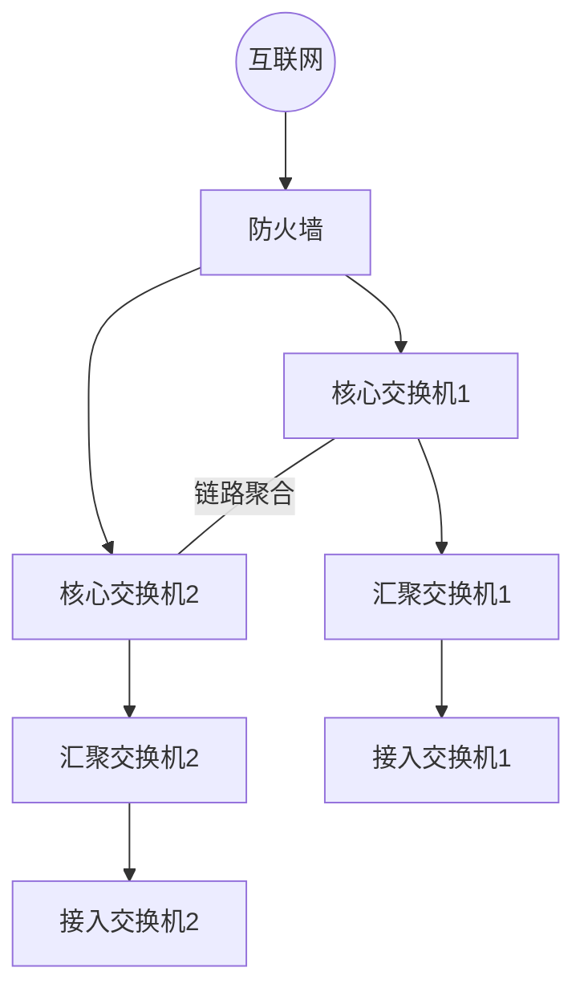

# 网络架构设计

## 一、企业网三层架构

参考来源：园区网设计行业规范、HCIE架构教材、GB 50174数据中心设计规范

### 三层架构模型

| 层级 | 核心功能 | 设备选型 | 关键技术 |
|------|---------|---------|---------|
| 接入层 | 面向终端设备接入、端口安全、VLAN划分 | 二层交换机 | 端口安全/POE/边缘端口 |
| 汇聚层 | VLAN间路由、ACL策略、路由聚合、负载均衡 | 三层交换机 | VRRP/OSPF/ACL/QoS |
| 核心层 | 高速转发、高可靠性、连接各汇聚层 | 高端三层交换机/路由器 | 链路聚合/冗余/OSPF/BGP |

### Spine-Leaf架构（数据中心）

| 特性 | 三层架构 | Spine-Leaf |
|------|---------|-----------|
| 扩展方式 | 纵向（增加汇聚层） | 横向（增加Spine/Leaf） |
| 延迟 | 不确定（跨多层） | 确定（仅2跳） |
| 东西向流量 | 需绕行核心 | 直接Leaf间转发 |
| 适用场景 | 传统企业网 | 数据中心/云计算 |

## 二、冗余网关设计

### VRRP（虚拟路由器冗余协议）

参考来源：RFC 3768

核心原理：多台路由器组成虚拟路由器组，共享虚拟IP，Master故障时Backup自动接管。

华为/H3C配置：
```
interface Vlanif10
 ip address 192.168.10.2 255.255.255.0
 vrrp vrid 10 virtual-ip 192.168.10.1
 vrrp vrid 10 priority 120
 vrrp vrid 10 preempt-mode timer delay 20
```

思科配置：
```
interface Vlan10
 ip address 192.168.10.2 255.255.255.0
 standby 10 ip 192.168.10.1
 standby 10 priority 120
 standby 10 preempt
```

### VRRP常见故障

- 主备切换失败：检查优先级、抢占配置、认证、接口状态
- 双Master：检查VRRP报文是否被拦截、心跳线是否正常

## 三、IP地址规划

### 规划原则

1. 连续性：同一区域IP地址连续，便于路由聚合
2. 扩展性：预留30%以上地址空间
3. 层次性：按区域/楼层/部门分层分配
4. 唯一性：确保地址不冲突

### 规划模板

| 区域 | VLAN | 网段 | 掩码 | 网关 | 用途 |
|------|------|------|------|------|------|
| 办公区 | VLAN10 | 192.168.10.0 | /24 | 192.168.10.1 | 员工办公 |
| 研发区 | VLAN20 | 192.168.20.0 | /24 | 192.168.20.1 | 研发测试 |
| 财务区 | VLAN30 | 192.168.30.0 | /24 | 192.168.30.1 | 财务系统 |
| 服务器区 | VLAN100 | 10.0.100.0 | /24 | 10.0.100.1 | 业务服务器 |
| 管理区 | VLAN999 | 10.0.999.0 | /24 | 10.0.999.1 | 设备管理 |

## 四、设备选型建议

### 交换机选型

| 场景 | 推荐类型 | 关键参数 |
|------|---------|---------|
| 接入层（50人以下） | 24口千兆二层交换机 | 背板带宽≥256Gbps、支持VLAN/STP |
| 接入层（50-200人） | 48口千兆+万兆上行 | 支持POE+/堆叠 |
| 汇聚层 | 三层交换机 | 支持OSPF/VRRP/ACL |
| 核心层 | 高端框式交换机 | 冗余电源/冗余主控/高背板带宽 |

### 路由器选型

| 场景 | 推荐类型 | 关键参数 |
|------|---------|---------|
| 小型出口 | 企业级路由器 | 转发性能≥1Mpps、支持NAT/VPN |
| 中型出口 | 模块化路由器 | 支持多WAN/策略路由/QoS |
| 大型出口 | 高端路由器 | 支持BGP/MPLS/高可用 |

### 防火墙选型

| 场景 | 吞吐量参考 | 关键功能 |
|------|----------|---------|
| 50人以下 | 1Gbps | 状态检测/NAT/VPN |
| 50-500人 | 5-10Gbps | IPS/AV/URL过滤 |
| 500人以上 | 10Gbps+ | 高可用/虚拟防火墙/国密 |

## 五、拓扑设计输出格式

### Mermaid语法示例



## 六、高可用方案设计

### 网络高可用关键要素

| 层面 | 方案 | 说明 |
|------|------|------|
| 设备级 | 冗余电源/冗余主控 | 单设备内硬件冗余 |
| 链路级 | 链路聚合(LACP) | 多物理链路捆绑 |
| 网关级 | VRRP/HSRP | 网关冗余切换 |
| 路由级 | OSPF多路径/ECMP | 等价多路径负载分担 |
| 出口级 | 双ISP/策略路由 | 运营商冗余 |

### 灾难恢复方案

- 数据中心双活：两地三中心
- 数据备份：3-2-1原则（3份副本、2种介质、1份异地）
- 网络恢复时间目标：RTO/RPO定义
